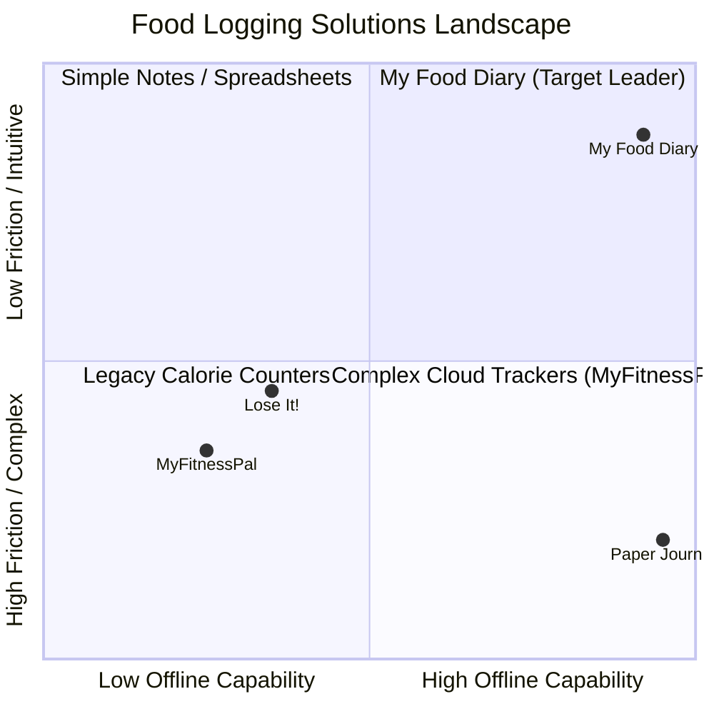

# Business Requirements Document (BRD)
## Project Name: My Food Diary Mobile Application
**Document Version:** 1.0.0  
**Status:** Approved / Production-Ready  
**Author:** Mobile Engineering Team  
**Date:** September 2026  

---

## 1. Executive Summary

### 1.1 Vision Statement
The **My Food Diary** mobile application is a high-performance, privacy-centric, and offline-first personal dietary tracking solution designed to empower individuals to effortlessly monitor their eating habits, understand nutritional trends, and export structured dietary reports for healthcare and fitness professionals.

### 1.2 Problem Statement
Modern health and nutrition applications present significant friction for everyday users:
- **Overcomplicated Workflows:** Many apps enforce laborious barcode scanning and multi-step manual calorie lookups, leading to user fatigue and abandonment within the first 7 days.
- **Strict Online Dependency:** Most commercial solutions fail or block access when users have poor or absent cellular connectivity (e.g., in subways, remote areas, or restaurants with weak reception).
- **Privacy & Data Monetization:** Users are increasingly reluctant to upload sensitive dietary information to third-party ad networks.
- **Inflexible Reporting:** Nutritionists and healthcare practitioners often require simple, standardized chronological food diaries rather than proprietary calorie dashboards.

### 1.3 Proposed Solution
**My Food Diary** bridges this gap by delivering:
- An ultra-fast, intuitive meal logging interface (Breakfast, Lunch, Dinner, Snack) with photo capture.
- A resilient **Offline-First Architecture** powered by local SQLite caching combined with background **Google Firebase** (Auth, Firestore, Cloud Storage) synchronization.
- Real-time interactive charts (Daily breakdown & Weekly frequency) to build dietary self-awareness.
- One-click **PDF Report Generation** with native operating system sharing to bridge patient-dietitian communication.

---

## 2. Business Objectives & Success Metrics

### 2.1 Primary Business Objectives
| Objective ID | Strategic Goal | Target KPI |
| :--- | :--- | :--- |
| **BO-01** | Rapid Logging Experience | Average time to log a meal < 15 seconds |
| **BO-02** | Zero Data Loss & 100% Offline Availability | 100% core feature uptime regardless of network status |
| **BO-03** | High User Retention | 30-day user retention rate > 45% |
| **BO-04** | Healthcare Professional Integration | At least 20% of active users utilize the PDF Export feature monthly |
| **BO-05** | Seamless Cross-Device Continuity | Automated cloud backup with sub-2 second sync latency upon reconnection |

### 2.2 Key Performance Indicators (KPIs)
- **Daily Active Users (DAU) to Monthly Active Users (MAU) Ratio:** Target > 0.40.
- **Log Completion Rate:** > 95% of initiated meal entries are saved successfully.
- **Crash-Free Session Rate:** Target > 99.8%.

---

## 3. Stakeholder Analysis

| Stakeholder Role | Interests & Expectations | Impact on Project |
| :--- | :--- | :--- |
| **End Users (Consumers)** | Fast logging, clean aesthetic UI, reliable dark mode, non-intrusive guest access. | High (Primary product adoption) |
| **Healthcare Practitioners (Dietitians/Doctors)** | Clean, chronological, printable PDF logs detailing meal timings, ingredients, and visual evidence. | Medium (B2B2C referral driver) |
| **Product Engineering & QA** | Clean Architecture, 100% test coverage for business logic, maintainable BLoC state management, scalable Firebase backend. | High (Product stability and velocity) |
| **Product Management** | Feature completeness, CV/portfolio enterprise standards, robust modular codebase. | High (Strategic alignment) |

---

## 4. Market & Competitive Analysis

### 4.1 Competitive Advantages
1. **True Offline-First:** Instant local SQLite writes eliminate UI spinners and network timeouts.
2. **Frictionless Onboarding:** "Continue as Guest" requires zero credentials while retaining full functionality.
3. **Direct PDF Delivery:** Eliminates the paywalls commonly imposed on export features in commercial apps.

---

## 5. Scope of the Application

### 5.1 In-Scope (Phase 1 - Production Ready)
- **Authentication:** Email/Password registration, Login, and Anonymous Guest access with Firebase Authentication.
- **Meal Management:** Create, Read, Update, Delete (CRUD) operations for 4 meal categories (Breakfast, Lunch, Dinner, Snack).
- **Media Support:** Camera photo capture and gallery picker with local storage and Firebase Cloud Storage synchronization.
- **Chronological Log:** Date-picker driven navigation, instant search query, and category chip filtering.
- **Visual Analytics:** Interactive Pie/Donut charts for daily meal proportions and Bar charts for weekly logging volume.
- **Reporting Engine:** Formatted A4 PDF generation with embedded meal metadata and direct native share sheet integration.
- **Theme Personalization:** Persistent Light and Dark themes conforming to Material 3 design guidelines.

### 5.2 Out-of-Scope (Future Releases)
- Automated AI food ingredient classification via computer vision.
- Barcode scanning database lookup for packaged grocery items.
- Wearable device synchronization (Apple Health / Google Health Connect).

---

## 6. Business Requirements Specification

### BR-01: User Identity & Session Management
- **Description:** The system must allow users to authenticate securely or operate as guests without immediate account creation.
- **Rationale:** Minimizes abandonment during the first app launch while allowing subsequent data sync across devices.
- **Acceptance Criteria:** Users can log in, register with email validation, or proceed as guest in under 2 taps.

### BR-02: Visual Meal Entry & Documentation
- **Description:** Users must be able to record meal details, timestamps, category, and attach a photographic record.
- **Rationale:** Visual documentation drastically increases compliance and accuracy compared to text-only journals.
- **Acceptance Criteria:** Meals must be saved to the database in < 100ms.

### BR-03: Real-Time Historical Exploration
- **Description:** The application must provide continuous access to historical meal records with instantaneous search and category filtering.
- **Rationale:** Users need to quickly review past meals when consulting with doctors or monitoring dietary triggers.
- **Acceptance Criteria:** Search queries and filter chips update the log view instantaneously with zero frame drops.

### BR-04: Actionable Dietary Summaries
- **Description:** Provide graphical representations of daily meal balance and weekly consistency.
- **Rationale:** Visual charts reinforce healthy eating habits and motivate consistent logging behavior.
- **Acceptance Criteria:** Charts dynamically calculate percentages and volume for today and the preceding 7 days.

### BR-05: Standardized Medical & Dietary Reporting
- **Description:** Enable one-touch generation of professional A4 PDF summary reports.
- **Rationale:** Provides tangible utility for clinical and fitness consultations.
- **Acceptance Criteria:** The PDF must generate cleanly on-device and open the native system share dialog for printing, emailing, or messaging.

---

## 7. Business Risks & Mitigation Strategies

| Risk Description | Probability | Impact | Mitigation Strategy |
| :--- | :---: | :---: | :--- |
| **Network Unavailability during meal logging** | High | High | Offline-first SQLite database architecture; all data persists locally and syncs lazily in the background. |
| **User Privacy & Device Migration** | Medium | High | Secure Firebase Authentication and rules-protected Cloud Firestore per-user data isolation. |
| **High Cloud Storage Bandwidth Cost** | Low | Medium | Local image compression prior to cloud upload; cached network URLs to reduce redundant requests. |

---

## 8. Approval & Sign-Off

| Name | Role | Signature | Date |
| :--- | :--- | :--- | :--- |
| **Lead Mobile Architect** | Technical Authority | *Approved* | 2026-09-26 |
| **Lead Product Manager** | Business Authority | *Approved* | 2026-09-26 |
