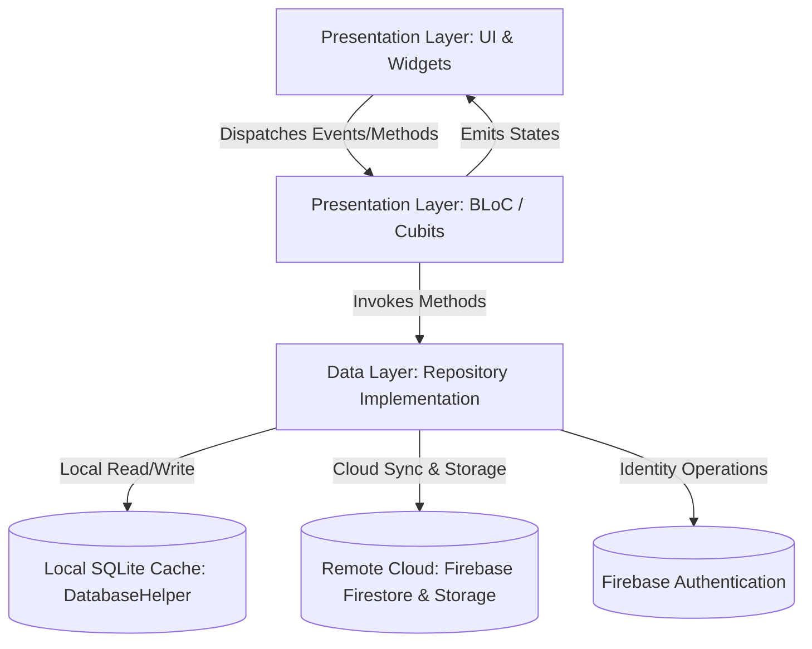
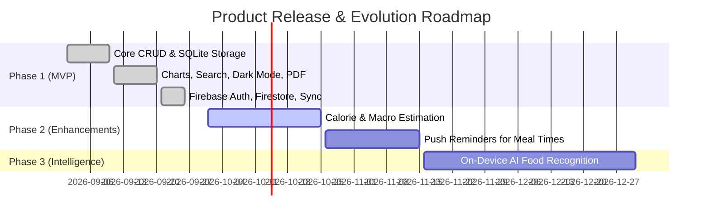

# Product Requirements Document (PRD)
## Project Name: My Food Diary Mobile Application
**Document Version:** 1.0.0  
**Target Release:** Production Release 1.0  
**Status:** Approved  
**Supported Platforms:** Android (minSdk 23, TargetSdk 35) & iOS (iOS 14+)  
**Technology Stack:** Flutter 3.29.3, Dart 3.7.2, BLoC/Cubit, GetIt, SQLite, Firebase (Auth, Firestore, Storage)  

---

## 1. Product Overview

### 1.1 Product Purpose
**My Food Diary** is a mobile application developed to provide a seamless, reliable, and aesthetically pleasing meal tracking experience. By utilizing an **Offline-First Clean Architecture**, the application guarantees instant responsiveness, high operational resilience without an active internet connection, and automatic cloud synchronization when connected.

### 1.2 Architectural Foundation
The product is engineered strictly adhering to **Feature-First Clean Architecture**:


---

## 2. Target User Personas

### Persona A: Sarah - The Routine Fitness Tracker
- **Age:** 28 | **Occupation:** Marketing Specialist
- **Behaviors:** Workouts 4-5 times a week; tracks meals to ensure adequate protein and balanced energy.
- **Pain Points:** Calorie tracker apps ask for too many obscure measurements and slow her down.
- **Goal in App:** Quickly snap a photo of her plate, select "Lunch", type "Grilled chicken breast and quinoa", and get back to work in 10 seconds.

### Persona B: David - The Health Clinic Patient
- **Age:** 45 | **Occupation:** Financial Consultant
- **Behaviors:** Managing digestive sensitivities under the guidance of a registered dietitian.
- **Pain Points:** Forgetting meal details between weekly appointments; handwritten food journals get lost or messy.
- **Goal in App:** Log daily meals with exact timestamps and export a clean, printable weekly PDF report to bring to his consultation.

### Persona C: Emily - The Frequent Commuter
- **Age:** 34 | **Occupation:** Architect
- **Behaviors:** Travels frequently on trains and subways with sporadic cellular reception.
- **Pain Points:** Apps hang with indefinite loading spinners when connectivity drops.
- **Goal in App:** 100% reliable offline logging that seamlessly syncs to the cloud later without data loss.

---

## 3. User Stories & Acceptance Criteria (Gherkin Format)

### US-01: User Authentication & Guest Access
- **As a** new or returning user,  
  **I want to** log in with email/password or proceed immediately as a guest,  
  **So that I can** access my food diary with or without an account setup upfront.
```gherkin
Scenario: Successful Sign Up with Valid Credentials
  Given the user is on the Register Screen
  When they enter a valid name "Fady", email "fady@example.com", and matching password "Password123"
  And they tap the "Create Account" button
  Then an account is created in Firebase Auth
  And a user profile is created in Cloud Firestore
  And the user is transitioned to the Home Screen with their name displayed in the header.

Scenario: Frictionless Guest Onboarding
  Given the user is on the Login Screen
  When they tap "Continue as Guest"
  Then an anonymous session is initiated
  And the user is granted immediate access to the Home Screen without credential prompts.
```

### US-02: Meal Logging with Imagery
- **As a** health-conscious user,  
  **I want to** record meal details, meal category, date, time, and attach a photo,  
  **So that I can** maintain visual and contextual memory of my daily food intake.
```gherkin
Scenario: Logging a Meal Successfully
  Given the user taps the Floating Action Button (+) or a meal category shortcut
  When they select "Lunch", type "Salmon with asparagus", confirm date and time, and attach a camera photo
  And they tap "Save Meal"
  Then the meal is immediately inserted into the local SQLite database
  And the image and meal data are queued and synced to Cloud Firestore and Firebase Storage
  And a success snackbar is presented to the user.
```

### US-03: Real-Time Historical Log Filtering
- **As a** user reviewing dietary history,  
  **I want to** search meals by keyword and filter by category chips,  
  **So that I can** locate specific past meals instantly.
```gherkin
Scenario: Filtering Daily Log by Query and Category
  Given the user is on the Daily Log Screen for the selected date
  When they select the "Breakfast" chip and type "Oats" in the search bar
  Then the meal list instantly updates to show only Breakfast entries containing "Oats"
  And the empty state is displayed if no matching meals are found.
```

### US-04: Analytical Summaries & Visual Trends
- **As a** user tracking my habits,  
  **I want to** view graphical breakdowns of today's meals and a 7-day volume chart,  
  **So that I can** identify dietary balance and consistency over time.
```gherkin
Scenario: Inspecting Weekly Logging Consistency
  Given the user navigates to the Weekly Summary Screen
  Then a 7-day Bar Chart displays the exact number of meals logged each day from Monday to Sunday
  And interactive touch tooltips display daily counts upon touch
  And a Donut Chart illustrates the weekly category proportion percentages.
```

### US-05: PDF Nutritional Report Export
- **As a** user sharing my log with a dietitian,  
  **I want to** generate a formatted PDF report with a single tap,  
  **So that I can** share or print a clinical-grade dietary record.
```gherkin
Scenario: Exporting A4 Nutritional PDF
  Given the user is on the Daily Log or Summary screen
  When they tap the "Export PDF" icon in the AppBar
  Then a structured A4 document is generated containing summary metrics and formatted tables
  And the native operating system share sheet opens displaying printing and sharing destinations.
```

---

## 4. Functional Requirements (FR)

| ID | Module | Feature Description | Priority | Complexity |
| :--- | :--- | :--- | :---: | :---: |
| **FR-01** | Authentication | Form validation for email format, password strength (>= 6 chars), and password matching. | P0 | Low |
| **FR-02** | Authentication | Support for Firebase Email/Password, Anonymous Guest mode, and session persistence via `SharedPreferences`. | P0 | Medium |
| **FR-03** | Meal Management | CRUD operations for meals: Create new meal, edit existing meal, delete meal with confirmation dialog. | P0 | Medium |
| **FR-04** | Meal Management | Media integration supporting camera capture and gallery selection with file permission handling. | P0 | Medium |
| **FR-05** | Daily Log | Chronological listing grouped by date with interactive calendar date selector. | P0 | Low |
| **FR-06** | Daily Log | Live keyword search across meal details with debounce and category filter chips (`All`, `Breakfast`, `Lunch`, `Dinner`, `Snack`). | P1 | Medium |
| **FR-07** | Analytics | Daily Donut chart with category percentages, central title, and colored legend indicators. | P1 | High |
| **FR-08** | Analytics | Weekly Bar chart displaying 7-day logging frequency with dynamic Y-axis intervals and touch tooltips. | P1 | High |
| **FR-09** | Reporting | Client-side A4 PDF document synthesis with branding headers, summary metrics, and meal tables. | P1 | High |
| **FR-10** | Settings & UI | Dynamic Light and Dark theme toggle with persistent state across app restarts. | P2 | Low |

---

## 5. Non-Functional Requirements (NFR)

### 5.1 Performance & Latency
- **Local Read/Write Latency:** All SQLite database writes (`insertMeal`, `updateMeal`, `deleteMeal`) must execute in under **50ms**.
- **Frame Rate:** UI animations, scrolling lists, and chart interactions must consistently render at **60 frames per second (fps)** with zero jank.
- **Cold Start Time:** App cold launch to the Home/Login screen must complete within **< 1.5 seconds** on modern Android devices.

### 5.2 Security & Data Privacy
- **Credential Storage:** User authentication state is tokenized; passwords are encrypted by Firebase Auth and never stored in plain text.
- **Transport Security:** All communication with Firebase Firestore and Firebase Storage must enforce **TLS 1.3 / HTTPS**.
- **Isolation:** Cloud Firestore security rules enforce strict read/write boundaries under `users/{userId}`.

### 5.3 Reliability & Offline First
- **Zero-Crash Offline Mode:** Absence of network connectivity must never throw unhandled exceptions or show network error dialogs on core screens.
- **Lazy Cloud Sync:** Network uploads run asynchronously without blocking the user interface.

### 5.4 Testability & Quality Assurance
- **Unit & BLoC Test Coverage:** 100% of Cubit state transitions and repository methods covered by automated unit tests (`bloc_test`, `mocktail`).
- **Linter Adherence:** 100% compliant with `flutter_lints` with **0 analyzer warnings or errors**.

---

## 6. Data Architecture & Database Schema

### 6.1 SQLite Database Schema (Local Device)
```sql
CREATE TABLE meals (
    id INTEGER PRIMARY KEY AUTOINCREMENT,
    meal_type TEXT NOT NULL,
    meal_details TEXT NOT NULL,
    date TEXT NOT NULL,
    time TEXT NOT NULL,
    photo_path TEXT,
    created_at TEXT NOT NULL
);
```

### 6.2 Cloud Firestore Document Schema (Remote)
- **Collection:** `users/{userId}`
  - `uid`: `String` (Firebase User Identifier)
  - `email`: `String`
  - `displayName`: `String`
  - `createdAt`: `ISO8601 Timestamp`
- **Subcollection:** `users/{userId}/meals/{mealId}`
  - `id`: `int` (Local SQLite reference ID)
  - `meal_type`: `String` (`Breakfast` | `Lunch` | `Dinner` | `Snack`)
  - `meal_details`: `String`
  - `date`: `String` (`dd/MM/yyyy`)
  - `time`: `String` (`HH:mm`)
  - `photo_path`: `String` (Cloud Storage public download URL)
  - `created_at`: `ISO8601 Timestamp`

### 6.3 Firebase Cloud Storage Hierarchy
```text
gs://my-food-diary-4e679.firebasestorage.app/
└── users/
    └── {userId}/
        └── meals/
            └── meal_{timestamp}.jpg
```

---

## 7. State Management Architecture

| Cubit | State Class | Responsibilities |
| :--- | :--- | :--- |
| **`AuthCubit`** | `AuthState` (`Initial`, `Loading`, `Authenticated`, `Unauthenticated`, `Error`) | Manages login, registration, guest session, and sign-out lifecycles. |
| **`MealCubit`** | `MealState` (`Initial`, `Loading`, `SaveSuccess`, `SaveError`) | Coordinates meal insertion, updates, image picking, and form submission. |
| **`DailyLogCubit`** | `DailyLogState` (`Initial`, `Loading`, `Loaded`, `Error`) | Coordinates chronological log retrieval, search queries, and category filtering. |
| **`SummaryCubit`** | `SummaryState` (`Initial`, `Loading`, `DailyLoaded`, `WeeklyLoaded`, `Error`) | Aggregates daily and weekly metrics for chart visualization. |
| **`ThemeCubit`** | `ThemeMode` (`light`, `dark`) | Manages dynamic visual mode and persists user preference. |

---

## 8. Release & Maintenance Plan


