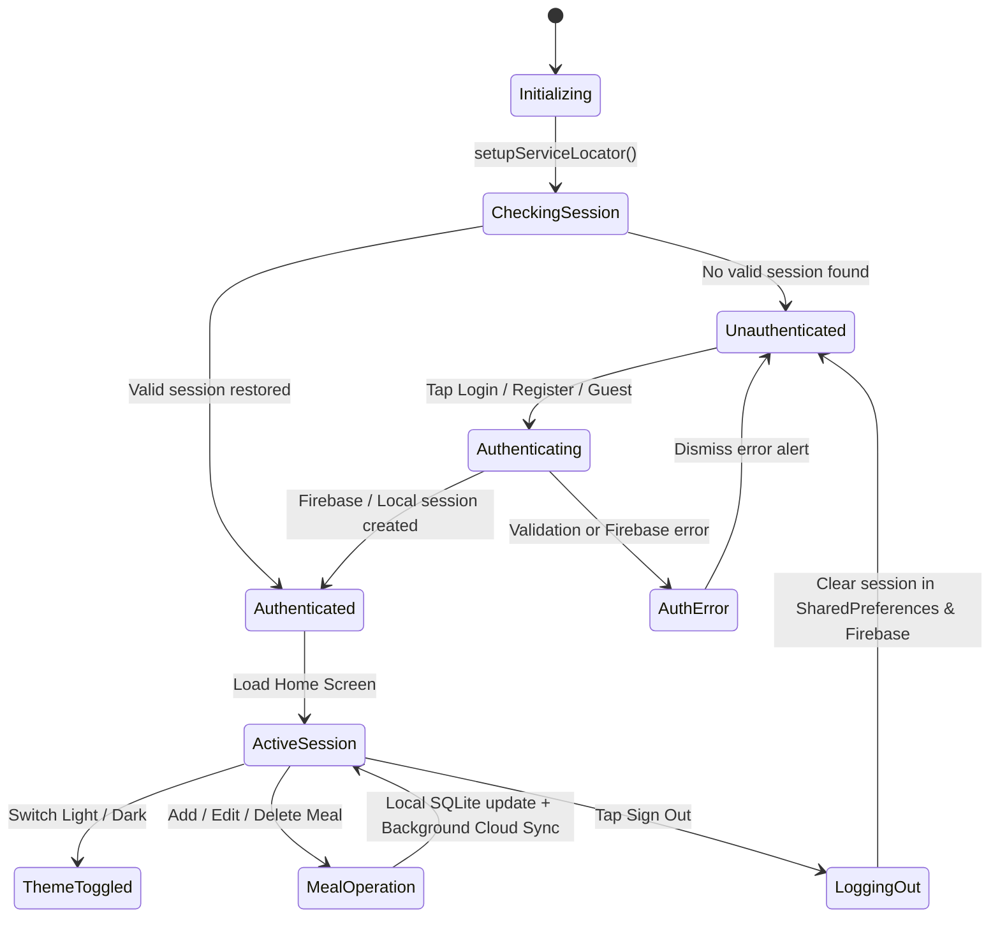
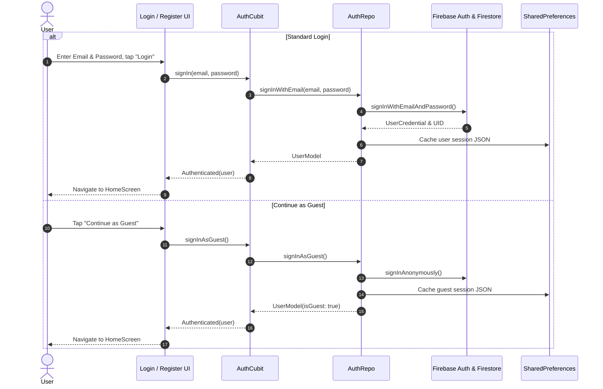
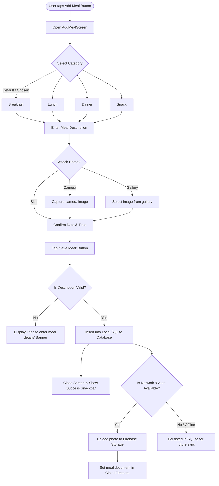
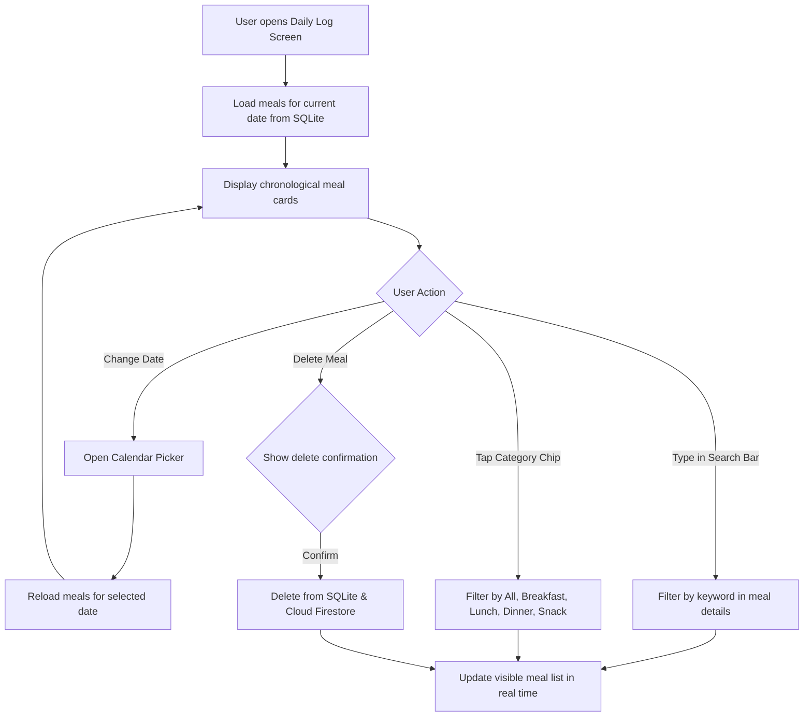
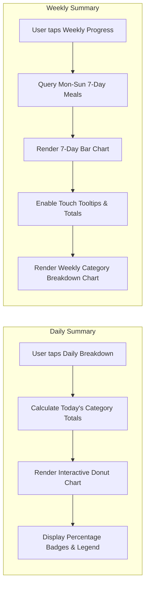
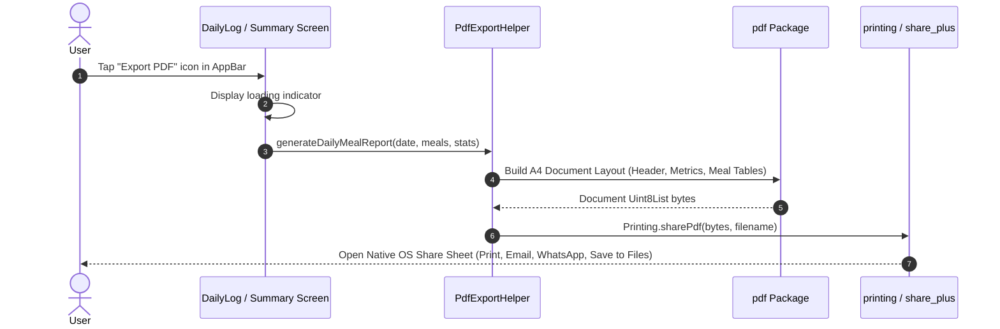

# User Flow & Information Architecture
## Project Name: My Food Diary Mobile Application
**Document Version:** 1.0.0  
**Status:** Approved  
**Author:** Mobile Engineering Team  
**Date:** September 2026  

---

## 1. Information Architecture (Site Map)

The application structure follows a clear hierarchical model designed for minimal taps and instant navigation:

```mermaid
graph TD
    AppLaunch[Application Launch] --> CheckSession{Has Stored Session?}
    CheckSession -->|No| LoginScreen[Login Screen]
    CheckSession -->|Yes| HomeScreen[Home Screen]

    LoginScreen -->|Tap Register| RegisterScreen[Register Screen]
    LoginScreen -->|Tap Continue as Guest| HomeScreen
    LoginScreen -->|Sign In Success| HomeScreen
    RegisterScreen -->|Sign Up Success| HomeScreen

    HomeScreen -->|Tap Floating Action Button| AddMealScreen[Add Meal Screen]
    HomeScreen -->|Tap Category Card| AddMealWithCategory[Add Meal Screen (Pre-selected)]
    HomeScreen -->|Tap Today's Meals Card| DailyLogScreen[Daily Log Screen (Today)]
    HomeScreen -->|Tap Today's Breakdown| DailySummaryScreen[Daily Summary Screen]
    HomeScreen -->|Tap Weekly Progress| WeeklySummaryScreen[Weekly Summary Screen]
    HomeScreen -->|Tap Theme Toggle Icon| ToggleTheme[Switch Light/Dark Mode]
    HomeScreen -->|Tap Sign Out Icon| LoginScreen

    DailyLogScreen -->|Tap Meal Item| EditMealScreen[Edit Meal Screen]
    DailyLogScreen -->|Tap Calendar Icon| DatePicker[Select Date Modal]
    DailyLogScreen -->|Type Query| FilterList[Live Filtered Meal List]
    DailyLogScreen -->|Select Category Chip| FilterCategory[Category Filtered Meal List]
    DailyLogScreen -->|Tap Export PDF| ShareSheet[Native PDF Share Sheet]

    DailySummaryScreen -->|Tap Export PDF| ShareSheet
    WeeklySummaryScreen -->|Tap Export PDF| ShareSheet
```

---

## 2. Global State Machine

The following state diagram specifies the global authentication and session lifecycle:



---

## 3. End-to-End User Flow Scenarios

### Flow 1: User Onboarding & Authentication



---

### Flow 2: Meal Creation & Visual Documentation



---

### Flow 3: Daily Log Exploration & Real-Time Filtering



---

### Flow 4: Visual Analytics & Progress Tracking



---

### Flow 5: PDF Dietary Report Generation & Native Sharing



---

## 4. Screen-by-Screen UI Component Specifications

### 4.1 Login Screen (`LoginScreen`)
- **Header:** Food Diary Logo, App Title, and welcoming subtitle.
- **Form Controls:**
  - Email TextField (`TextInputType.emailAddress`, email regex validation).
  - Password TextField (`obscureText: true`, visibility toggle).
- **Actions:**
  - "Sign In" Primary Button.
  - "Continue as Guest" Outlined Button.
  - "Don't have an account? Sign Up" navigation link.

### 4.2 Register Screen (`RegisterScreen`)
- **Form Controls:**
  - Full Name TextField (Mandatory).
  - Email Address TextField (Format validation).
  - Password TextField (Minimum 6 characters).
  - Confirm Password TextField (Exact matching validator).
- **Actions:**
  - "Create Account" Primary Button.
  - Back navigation to Login Screen.

### 4.3 Home Screen (`HomeScreen`)
- **AppBar:**
  - Greeting header: `"Hello, {DisplayName}"` or `"Hello, Guest"`.
  - Theme mode toggle button (Sun / Moon icon).
  - Sign-out action icon with confirmation dialog.
- **Body Dashboard:**
  - Meal Category Quick Shortcuts (4 interactive cards: Breakfast, Lunch, Dinner, Snack).
  - "Today's Meals" quick entry card with progress count.
  - "Daily Breakdown" interactive summary card.
  - "Weekly Progress" 7-day analytical summary card.
- **Floating Action Button (FAB):** Centered (+) button to add a new meal instantly.

### 4.4 Daily Log Screen (`DailyLogScreen`)
- **AppBar:**
  - Title with calendar date selector (`IconButton(icon: Icons.calendar_month)`).
  - "Export PDF" action button.
- **Search & Filter Bar:**
  - Real-time text search bar with clear icon.
  - Horizontal filter chips: `All`, `Breakfast`, `Lunch`, `Dinner`, `Snack`.
- **Meal List:**
  - Card view showing meal type badge, formatted time, details snippet, and thumbnail image.
  - Slide-to-dismiss or delete button with confirmation dialog.

### 4.5 Summary Screens (`DailySummaryScreen` & `WeeklySummaryScreen`)
- **AppBar:** Screen title and "Export PDF" action button.
- **Metric Cards:** Total meals logged, most active meal category, logging streak.
- **Interactive Charts:**
  - FlChart PieChart with animated touch expansion.
  - FlChart BarChart with Mon-Sun labels and tooltip badges.

---

## 5. Edge Cases & Resilience Engineering

| Edge Case | Potential Impact | System Resolution |
| :--- | :--- | :--- |
| **No Internet Connectivity** | Cloud sync fails | App operates 100% normally using local SQLite database. Firebase synchronization is caught gracefully without error popups. |
| **User Skips Photo Capture** | Meal has no visual asset | Default meal type vector graphic is rendered in the UI and PDF report. |
| **Search Yields No Results** | Empty list | Beautiful empty-state illustration with "No meals match your search query" and a "Reset Filters" action button. |
| **First-Time User (Zero Meals)** | Blank dashboard | Guided call-to-action cards encouraging user to log their first meal. |
| **Camera Permission Denied** | Inability to take photo | Graceful fallback prompting the user to pick from the photo library or continue with text details only. |
| **Session Expiry / Token Refresh** | Potential auth failure | Silent token refresh via Firebase SDK, with automatic graceful fallback to cached session. |
